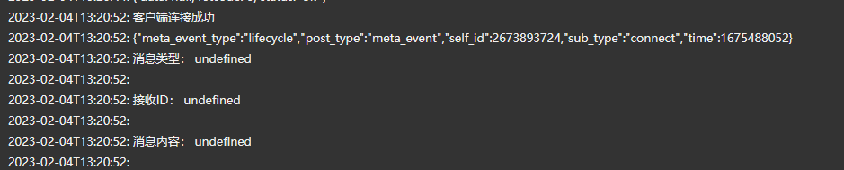
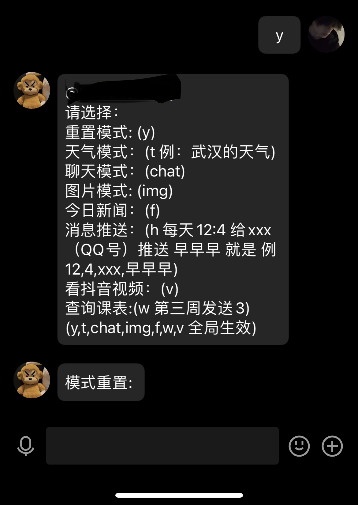
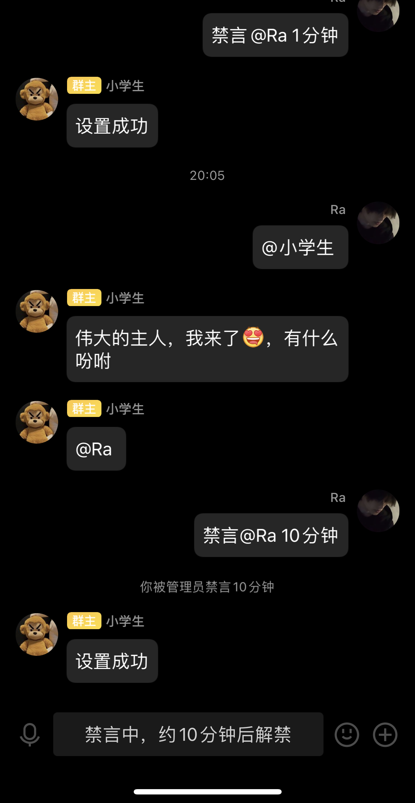

## QQbat机器

### 基于go-cqhttp与JavaScript 语言实现

### 1 功能如下
                                          
| 序号 | 模式 (私聊模式)                  | 模式 (群聊模式)    |
|:----|:---------------------------|:-------------|
| 1.  | 重置模式: (y)                  | 撤回消息         |
| 2.  | 天气模式: (t)                  | 看视频          |
| 3.  | 聊天模式：(chat 接入chatgpt)      | 通知助手         |
| 4.  | 图片模式: (img)                | 禁言,取消禁言      |
| 5.  | 今日新闻： (f)                  | chatgpt聊天机器人 |
| 6.  | 定时消息推送：(h 例 12,4,xxxx,早早早) | 群消息防撤回       |
| 7.  | 学习通课表提送功能 (w 第三周发送3)       | 消息验证         |        
| 8.  | 看小视频(v)                    | 查询发送消息条数     |

### 2配置 config.yml

#### 1. 进入配置qq账号密码

         uin: xxxxxxxx  # QQ账号  
         password: xxxxxx # 密码为空时使用扫码登录

#### 2. 选择通信方式为 0 3

     - http: # HTTP 通信设置
      address: 0.0.0.0:5000 # HTTP监听地址
      timeout: 5      # 反向 HTTP 超时时间, 单位秒，<5 时将被忽略
      long-polling:   # 长轮询拓展
        enabled: false       # 是否开启
        max-queue-size: 2000 # 消息队列大小，0 表示不限制队列大小，谨慎使用
      middlewares:
        <<: *default # 引用默认中间件
      post:           # 反向HTTP POST地址列表
       # 反向WS设置
      - ws-reverse:
     # 反向WS Universal 地址
     # 注意 设置了此项地址后下面两项将会被忽略
      universal: ws://127.0.0.1:5700
      # 反向WS API 地址
      api: ws://your_websocket_api.server
      # 反向WS Event 地址
      event: ws://your_websocket_event.server
      # 重连间隔 单位毫秒
      reconnect-interval: 3000
      middlewares:
      <<: *default # 引用默认中间件

#### 3.开启服务

         双击go-cqhttp.bat
       ./go-cqhttp  enter运行

#### 4.服务器需要安装依赖

       npm install

#### 5.api接口请访问

<https://docs.go-cqhttp.org/>

#### 6.结果

#### 6.说明：
     部署到阿里云或者腾讯云服务器上查询学习通课表无法使用，学习通屏蔽了服务器ip

#### 7.声明 练手学习使用，无其他用途

      如有疑问请联系3096407768@qq.com
      go-cqhttp请去官网下载，仓库中只是服务端逻辑处理代码
      app.js为项目入口文件

